# Day 4: Thursday August 23

## Overview

### Lead Instructor
- [Gabriele Schweikert](http://homepages.inf.ed.ac.uk/gschweik/) |  [email](mailto:gabriele.schweikert@gmail.com)

### Co-Instructor(s)
- David Helekal | [email](mailto:d.helekal@dundee.ac.uk)

### Helper(s)
- Maria Tsagiopoulou | [email](mariatsayo@gmail.com)
- Ola Karrar | [@ZeinOla][https://twitter.com/ZeinOla] | [email](ozkarrar2@gmail.com)


### General Topics
- Introduction to epigenomics
-  ChIP-Seq Differential Modification Calling
    - Pre-processing
    - Peak Calling
    - Differential Peak Calling
- Analysing DNA methylation
    - Reduced Representation Bisulfit Sequencing (RRBS)
    - Differential Methylation Calling on CpGs
    - Differentially Methylated Regions
    - Annotation  


## Schedule

- _**09:00 - 10:00**_  (_Lecture_) Epigenomics 1: Analysing Chromatin: ChIP-Seq, ATAC-Seq, and beyond.

- _**10:00 - 11:00**_ (Hands-on) ChIP-Seq  Analysis Pipeline

- _**11:00 - 11:30**_ _**Coffee break**_

- _**11:30 - 12:30**_ (Hands-on) ChIP-Seq  Analysis Pipeline

- _**12:30 - 14:00**_ _**Lunch break**_

- _**14:00 - 15:00**_   (_Lecture_) Epigenomics 2: Experiment and Analysis for DNA methylation detection (RRBS)

- _**15:00 - 16:00**_ (Hands-on) RRBS Analysis Pipeline

- _**16:00 - 16:15**_ _**Coffee break**_

- _**16:15 - 18:00**_ (Hands-on) RRBS Analysis Pipeline


This entire lesson can be found in `RMD` format [here](https://raw.githubusercontent.com/fpsom/CODATA-RDA-Advanced-Bioinformatics-2018/master/files/data/ChIPSeqLesson.Rmd) - you can use `knitr` to recreate/rerun all exercises, if you also download the corresponding data as well (see below).


## Bioconductor Packages / Setup

Bioconductor has many packages which support the analysis of high-throughput sequence data; currently there are more than 70  packages that can be used to analyse ChIP-seq data. A list, and short description of available packages can be found here: [BiocView  ChIP-Seq](http://bioconductor.org/packages/release/BiocViews.html#___ChIPSeq)

Bioconductor has scheduled releases every 6 months, with these releases new versions of the packages will become available.

The Bioconductor project ensures that all the packages within a release will work together in harmony (hence the “conductor” metaphor).

If you haven’t installed the packages that we need to run this tutorial you will need to do so now.

```
source("https://bioconductor.org/biocLite.R")
biocLite("knitr")
biocLite("kableExtra")
biocLite("TxDb.Hsapiens.UCSC.hg38.knownGene")
biocLite("BSgenome.Hsapiens.UCSC.hg38")
biocLite("DiffBind")
biocLite('MotifDb')
biocLite('methylKit')
biocLite('genomation')
biocLite('ggplot2')
biocLite('TxDb.Mmusculus.UCSC.mm10.knownGene')
biocLite("AnnotationHub")
biocLite("annotatr")
biocLite("bsseq")
biocLite("DSS")
```

Check that all packages can be loaded:

```
library("knitr")
library("kableExtra")
library("TxDb.Hsapiens.UCSC.hg38.knownGene")
library("BSgenome.Hsapiens.UCSC.hg38")
library("DiffBind")
library('MotifDb')
```

## ChIP-Seq Data Analysis

During this course we shall look at the analysis of a typical (very simple) ChIP-Seq experiment.
We will start from the `fastq` files, and briefly look at alignment and pre-processing steps. These will not be run during the tutorial due to time constraints. Instead you will be provided with pre-processed bam files. However, by following the instructions you will be able to create the provided files on your own.

We will focus on the Histone modification H3K4me3 and will try to detect differences in the genomic distribution of this epigenomic mark between two different cell lines: human embryonic stem cells H1 and fetal lung cells, myofibroblasts, IMR90 cells. We will follow two different strategies: 1) It is well known that the modification H3K4me3 is predominantly found around gene promoters, and we will thus use annotated genes to define regions of interests (ROIs) around their promoters. We will try to find H3K4me3 differences in these regions. 2) We will also follow a more data driven approach where we use a peak caller to identify regions of significant enrichment relative to the background and we will also do a differential modification analysis in those regions.

### Data
During the tutorial we will use data from the [Roadmap Epigenomics Project](http://www.roadmapepigenomics.org).

After locating the data  [Epigenomics_metadata.xlsx](ftp://ftp.ncbi.nlm.nih.gov/pub/geo/DATA/projects/NCBI_Epigenomics_metadata.xlsx) we have stored the relevant SRR accession numbers in a SRR_table file which we have used to downloaded the data using fastq_dump:

```
less SRR_table | parallel "fastq-dump --outdir fastq  --gzip --skip-technical  --readids --read-filter pass --dumpbase --split-3 --clip {}"
```

We have already prepared the data sets for you. Please download the data either from [http://bifx-core.bio.ed.ac.uk/Gabriele/public/Trieste_Data.tar.gz](http://bifx-core.bio.ed.ac.uk/Gabriele/public/Trieste_Data.tar.gz), or from the course GitHub repo [here](https://raw.githubusercontent.com/fpsom/CODATA-RDA-Advanced-Bioinformatics-2018/master/files/data/Trieste_Data.tar.gz). The file is ~210MB in size, so please allow for some time to download and uncompress the data.

### Preprocessing Data

We have preprocessed the data sets for you and will not do these steps in class. We will talk you through the different steps such that you can do it on your own data.
You will use a number of command-line tools, most of which you have encountered in the last couple of days:

* [**fastqc**](https://www.bioinformatics.babraham.ac.uk/projects/fastqc/), a quality control tool for high throughput sequence data.  

* [**mulitqc**](http://multiqc.info) to aggregate results from bioinformatics analyses across many samples into a single report.

* [**trim_galore**](https://www.bioinformatics.babraham.ac.uk/projects/trim_galore/), a wrapper tool around Cutadapt to apply quality and adapter trimming to FastQ files.

* [**Bowtie2**](http://bowtie-bio.sourceforge.net/bowtie2/index.shtml), is a fast and memory-efficient tool for aligning sequencing reads to long reference sequences.

* [**samtools**](http://www.htslib.org), a set of utilities that manipulate alignments in the BAM format. It imports from and exports to the SAM (Sequence Alignment/Map) format, does sorting, merging and indexing, and allows to retrieve reads in any regions swiftly.

Additionally, we use the GNU [**Wget**](https://www.gnu.org/software/wget/) package for retrieving files using HTTP, HTTPS, FTP and FTPS and the GNU [**parallel**](https://www.gnu.org/software/parallel/) tool for executing jobs in parallel using one or more computers, such that different fastq files can be processed all at the same time rather than sequentially.

### Quality Control

Before we continue, we would like to assess the quality of each data file that we have downloaded so far. To do that we use the **`fastqc`** tool, e.g.:   

```
cd fastq
fastqc IMR90-H3K4me3-1-1.fastq.gz
```

This generates a file *IMR90-H3K4me3-1-1_fastqc.html* and a corresponding *IMR90-H3K4me3-1-1_fastqc.zip*. By opening the html file we can inspect the result [html](https://raw.githubusercontent.com/fpsom/CODATA-RDA-Advanced-Bioinformatics-2018/master/files/ChIPSeq-Output/IMR90-H3K4me3-1-1_fastqc.html). As you can see, there are several issues with this file and we will have to use `trim_galore` to filter the reads.

As we want to run `fastqc` for each `fastq` file in the directory, we would like to speed up the process by using the GNU **`parallel`** function. Here we use the **`ls`** function to list all files ending on `.fastq.gz`, we then pass all these file names on to the `fastqc` tool using the `|` (pipe) functionality.  


```
ls *fastq.gz | parallel "fastqc {}"
```

### Trimmming

As we have observed in the `fastqc` report, many reads have low quality towards the end of the read. Additionally, we have adapter contamination. To remove these issues we run `trim_galore`, which will also create another `fastqc` report:

```
ls *fastq.gz | parallel -j 30 trim_galore  --stringency 3 --fastqc -o trim_galore/ {}
```

Compare the overall quality of the remaining reads after trimming with the original report. You can see the new report
[here](https://raw.githubusercontent.com/fpsom/CODATA-RDA-Advanced-Bioinformatics-2018/master/files/ChIPSeq-Output/IMR90-H3K4me3-1-1_trimmed_fastqc.html).

Eventually, we use *`multqc`* to aggregate the results.   


```
ls *.fastq.gz | parallel fastqc
multiqc
```

The multiqc reports can be viewed [here](https://raw.githubusercontent.com/fpsom/CODATA-RDA-Advanced-Bioinformatics-2018/master/files/ChIPSeq-Output/multiqc_report.html).

### Alignment

```
bowtie2-build Annotation/Homo_sapiens.a.dna.primary_assembly.fa GRCh38
ls *_trimmed.fq.gz | parallel -j 30 bowtie2 -x GRCh38 -U {} -S {}.sam
ls *.sam | parallel "samtools view -bS {} | samtools sort - -o {}.bam"
ls *.bam | parallel "samtoots index {}"
```

### Merge files and subset for tutorial

To merge files from the different lanes:

```
samtools merge IMR90-H3K4me3-1.bam IMR90-H3K4me3-1-1_trimmed.fq.gz.sam.bam IMR90-H3K4me3-1-2_trimmed.fq.gz.sam.bam
```

Next we need to index these bam files

```
samtools index IMR90-H3K4me3-1.bam
```


```
samtools view -h IMR90-H3K4me3-2.bam 19 > chr19-IMR90-H3K4me3-2.sam

samtools view -bS chr19-IMR90-H3K4me3-2.sam > chr19-IMR90-H3K4me3-2.bam
```

These bam and index files are available for you in the [Bowtie2](http://bifx-core.bio.ed.ac.uk/Gabriele/public/Trieste_Data/ChIP-Seq/Bowtie2) sub-directory of your downloaded **Trieste_Data.tar.gz** folder.

### Creating Sample Sheet

We will now create a sample sheet that captures the most important information about the data. To do that open a new text file in RStudio, copy the information below into the file, remove empty spaces and replace them with commas and save it as a comma separated file (.csv), **`SampleSheet.csv`** file. Note that for later analysis, it is important to include the precise column names and remove newline and empty spaces.

<table class="table table-condensed" style="font-size: 12px; ">
 <thead>
  <tr>
   <th style="text-align:left;"> SampleID </th>
   <th style="text-align:left;"> Tissue </th>
   <th style="text-align:left;"> Factor </th>
   <th style="text-align:left;"> Condition </th>
   <th style="text-align:right;"> Replicate </th>
   <th style="text-align:left;"> bamReads </th>
   <th style="text-align:left;"> ControllID </th>
   <th style="text-align:left;"> bamControl </th>
  </tr>
 </thead>
<tbody>
  <tr>
   <td style="text-align:left;"> IMR90-H3K4me3-1 </td>
   <td style="text-align:left;"> IMR90 </td>
   <td style="text-align:left;"> H3K4me3 </td>
   <td style="text-align:left;"> Ctr </td>
   <td style="text-align:right;"> 1 </td>
   <td style="text-align:left;"> Trieste_Data/ChIP-Seq/bowtie2/chr19-IMR90-H3K4me3-1.bam </td>
   <td style="text-align:left;"> IMR90-Input </td>
   <td style="text-align:left;"> Trieste_Data/ChIP-Seq/bowtie2/chr19-IMR90-Input.bam </td>
  </tr>
  <tr>
   <td style="text-align:left;"> IMR90-H3K4me3-2 </td>
   <td style="text-align:left;"> IMR90 </td>
   <td style="text-align:left;"> H3K4me3 </td>
   <td style="text-align:left;"> Ctr </td>
   <td style="text-align:right;"> 2 </td>
   <td style="text-align:left;"> Trieste_Data/ChIP-Seq/bowtie2/chr19-IMR90-H3K4me3-2.bam </td>
   <td style="text-align:left;"> IMR90-Input </td>
   <td style="text-align:left;"> Trieste_Data/ChIP-Seq/bowtie2/chr19-IMR90-Input.bam </td>
  </tr>
  <tr>
   <td style="text-align:left;"> H1-H3K4me3-1 </td>
   <td style="text-align:left;"> H1 </td>
   <td style="text-align:left;"> H3K4me3 </td>
   <td style="text-align:left;"> Ctr </td>
   <td style="text-align:right;"> 1 </td>
   <td style="text-align:left;"> Trieste_Data/ChIP-Seq/bowtie2/chr19-H1-H3K4me3-1.bam </td>
   <td style="text-align:left;"> H1-Input </td>
   <td style="text-align:left;"> Trieste_Data/ChIP-Seq/bowtie2/chr19-H1-Input-2.bam </td>
  </tr>
  <tr>
   <td style="text-align:left;"> H1-H3K4me3-3 </td>
   <td style="text-align:left;"> H1 </td>
   <td style="text-align:left;"> H3K4me3 </td>
   <td style="text-align:left;"> Ctr </td>
   <td style="text-align:right;"> 3 </td>
   <td style="text-align:left;"> Trieste_Data/ChIP-Seq/bowtie2/chr19-H1-H3K4me3-3.bam </td>
   <td style="text-align:left;"> H1-Input </td>
   <td style="text-align:left;"> Trieste_Data/ChIP-Seq/bowtie2/chr19-H1-Input-2.bam </td>
  </tr>
</tbody>
</table>

## Defining Regions of Interests

To analyse the ChIP-Seq data sets we first have to think about, the regions which we want to examine in detail. One obvious choice is to look at all those regions where the ChIP signal is significantly increased relative to the background signal. We will use a Peak caller (`MACS2`) shortly to detect these regions. However, the performance of  peak callers depends on the right set of parameters, the signal-to-noise-ratio of your data and a lot of other things. So, sometimes it is also interesting to use prior information about the data to inform your choice of regions. For example, it is well known that H3K4me3 is found predominantly around promoters of actively transcribed genes. As genes a reasonably well annotated in human, it is worth to also take a 'supervised' approach, where we look at defined windows around transcription start sites (TSS). This is what we are doing in the following. After that we will also look at enriched regions called by MACS2.


### Use Annotation to Define Promoter Regions

Bioconductor provides an easy R interface to a number of prefabricated databases that contain annotations. You will learn more about available databases here: [AnnotationDbi](https://bioconductor.org/packages/release/bioc/vignettes/AnnotationDbi/inst/doc/IntroToAnnotationPackages.pdf)
One such package is **`TxDb.Hsapiens.UCSC.hg38.knownGene`** which accesses UCSC build hg19 based on the `knownGene` Track. Here we are first interested in annotated genes in this database:

```
library("TxDb.Hsapiens.UCSC.hg38.knownGene")

txdb <- TxDb.Hsapiens.UCSC.hg38.knownGene
G = genes(txdb, columns="gene_id", filter=NULL, single.strand.genes.only=TRUE)
```

Have a look at the object:

```
G
```

```
## GRanges object with 24183 ranges and 1 metadata column:
##             seqnames              ranges strand |     gene_id
##                <Rle>           <IRanges>  <Rle> | <character>
##           1    chr19   58345178-58362751      - |           1
##          10     chr8   18391245-18401218      + |          10
##         100    chr20   44619522-44651742      - |         100
##        1000    chr18   27950966-28177446      - |        1000
##   100009613    chr11   70072434-70075433      - |   100009613
##         ...      ...                 ...    ... .         ...
##        9991     chr9 112217716-112333667      - |        9991
##        9992    chr21   34364024-34371389      + |        9992
##        9993    chr22   19036282-19122454      - |        9993
##        9994     chr6   89829894-89874436      + |        9994
##        9997    chr22   50523568-50526439      - |        9997
##   -------
##   seqinfo: 455 sequences (1 circular) from hg38 genome
```

```
summary(width(G))
```

```
##     Min.  1st Qu.   Median     Mean  3rd Qu.     Max.
##       41     5801    21374    69152    61456 36632075
```

```
hist(width(G)[width(G)<100000]/1000,breaks = 1000, main = 'Histogram of Gene Lengths',xlab='gene length in kbp')
```

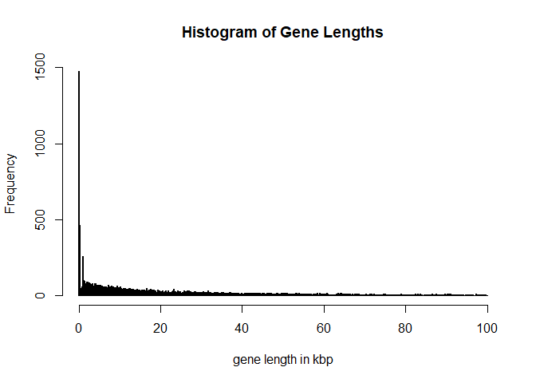

For simplicity (and to practice R) we would like to look at genes which are longer than 2000bp but smaller than 1Mbp, are on chromosome 19 and are also having a gap to their neighboring genes of at least 2000bp.


```
longGenes = G[width(G)>2000 & width(G)<100000 & seqnames(G)=='chr19']
summary(width(longGenes))
```

```
##    Min. 1st Qu.  Median    Mean 3rd Qu.    Max.
##    2009    8592   15902   22173   30162   98903
```

```
hist(width(longGenes)/1000,breaks = 1000,main = 'Histogram of Filtered Gene Lengths',xlab='gene length in kbp')
```

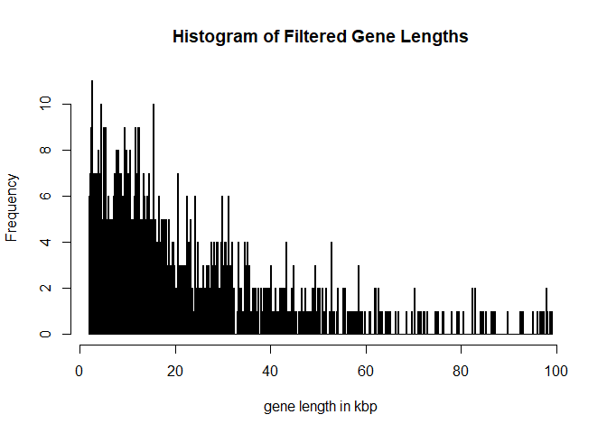

We will next filter out overlapping genes or genes which are close to a neighboring gene.

```
ov = findOverlaps( G,longGenes,maxgap=2000)
ii = which(duplicated(subjectHits(ov)))
OverlappingGenes = longGenes[subjectHits(ov)[ii]]
nonOverlappinglongGenes = longGenes[-subjectHits(ov)[ii]]
```

Test if we didn't make a mistake:

```
ov = findOverlaps(nonOverlappinglongGenes ,G)
```

For the filtered genes we next look at promoter regions:

```
Promoters = promoters(nonOverlappinglongGenes ,upstream=2000, downstream=200)
Promoters
```

```
## GRanges object with 838 ranges and 1 metadata column:
##             seqnames            ranges strand |     gene_id
##                <Rle>         <IRanges>  <Rle> | <character>
##   100073347    chr19 56838902-56841101      + |   100073347
##   100128252    chr19 56475603-56477802      + |   100128252
##   100128398    chr19 58000061-58002260      + |   100128398
##   100128568    chr19   5976403-5978602      + |   100128568
##   100128675    chr19 35106105-35108304      - |   100128675
##         ...      ...               ...    ... .         ...
##        9667    chr19   5623847-5626046      - |        9667
##        9668    chr19 52048621-52050820      - |        9668
##         970    chr19   6603904-6606103      - |         970
##         976    chr19 14378501-14380700      + |         976
##        9817    chr19 10503542-10505741      - |        9817
##   -------
##   seqinfo: 455 sequences (1 circular) from hg38 genome
```

For our toy example we will only use a random subset of 500 of these regions. We will use the random number generator but set a seed such that our code is reproducible.


```
set.seed(1237628)
idx = sort(sample(x=length(Promoters),size=500,replace=FALSE))
candPromoters = Promoters[idx]
```

Now save your object in case you want to use it again later. You can also write it out as a bed file.


```
save(file='Trieste_Data/ChIP-Seq/RoI/candPromoters.rData',candPromoters,nonOverlappinglongGenes)

df <- data.frame(seqnames=seqnames(candPromoters),
  starts=start(candPromoters)-1,
  ends=end(candPromoters),
  names=paste('Promoter-',seq(1,length(candPromoters)),sep=''),
  scores=c(rep(1, length(candPromoters))),
  strands=strand(candPromoters))

write.table(df, file="Trieste_Data/ChIP-Seq/candPromoters.bed", quote=F, sep="\t", row.names=F, col.names=F)
```

### Detecting Enriched Regions

Next, we will examine regions that are detected to be significantly enriched by a peak caller.  We are using MACS2 and we are trying to find enriched regions in each of the ChIP samples relative to the cell specific Input.  We have already prepared this step for you, so you do not need to run the following steps. (Note, that if you run it on your own, you need to use the shell / terminal not R console.)


```
macs2 callpeak -t Bowtie2/chr19-IMR90-H3K4me3-1.bam  -c  Bowtie2/chr19-IMR90-Input.bam  -g hs -q 0.01  --call-summits -n IMR90-H3K4me3-1 --outdir MACS2

macs2 callpeak -t Bowtie2/chr19-IMR90-H3K4me3-2.bam  -c  Bowtie2/chr19-IMR90-Input.bam  -g hs -q 0.01  --call-summits -n IMR90-H3K4me3-2 --outdir MACS2


macs2 callpeak -t Bowtie2/chr19-H1-H3K4me3-1.bam  -c  Bowtie2/chr19-H1-Input-2.bam  -g hs -q 0.01  --call-summits -n H1-H3K4me3-1 --outdir MACS2

macs2 callpeak -t Bowtie2/chr19-H1-H3K4me3-3.bam  -c  Bowtie2/chr19-H1-Input-2.bam  -g hs -q 0.01  --call-summits -n H1-H3K4me3-3 --outdir MACS2
```


These Files are available for you in the [MACS2](http://bifx-core.bio.ed.ac.uk/Gabriele/public/CamBioScience/EpiCourse2018_Data/MACS2) sub-directory of your downloaded **Trieste_Data.tar.gz** Folder.

## Differential Region (Occupancy)  Analysis (DiffBind)

Now, we are finally ready for the real thing: Finding differences between the two cell lines, H1 and IMR90. For this task we will use the [DiffBind](http://bioconductor.org/packages/release/bioc/html/DiffBind.html) Bioconductor package.

First, we will append our SampleSheet with columns specifying the MACS2 called enriched regions for each sample:

<table class="table table-condensed" style="font-size: 12px; ">
 <thead>
  <tr>
   <th style="text-align:left;">   </th>
   <th style="text-align:left;"> SampleID </th>
   <th style="text-align:left;"> Tissue </th>
   <th style="text-align:left;"> Factor </th>
   <th style="text-align:left;"> Condition </th>
   <th style="text-align:right;"> Replicate </th>
   <th style="text-align:left;"> bamReads </th>
   <th style="text-align:left;"> ControllID </th>
   <th style="text-align:left;"> bamControl </th>
   <th style="text-align:left;"> Peaks </th>
   <th style="text-align:left;"> PeakCaller </th>
  </tr>
 </thead>
<tbody>
  <tr>
   <td style="text-align:left;"> 1 </td>
   <td style="text-align:left;"> IMR90-H3K4me3-1 </td>
   <td style="text-align:left;"> IMR90 </td>
   <td style="text-align:left;"> H3K4me3 </td>
   <td style="text-align:left;"> Ctr </td>
   <td style="text-align:right;"> 1 </td>
   <td style="text-align:left;"> Trieste_Data/ChIP-Seq/bowtie2/chr19-IMR90-H3K4me3-1.bam </td>
   <td style="text-align:left;"> IMR90-Input </td>
   <td style="text-align:left;"> Trieste_Data/ChIP-Seq/bowtie2/chr19-IMR90-Input.bam </td>
   <td style="text-align:left;"> Trieste_Data/ChIP-Seq/MACS2/IMR90-H3K4me3-1_peaks.xls </td>
   <td style="text-align:left;"> macs </td>
  </tr>
  <tr>
   <td style="text-align:left;"> 2 </td>
   <td style="text-align:left;"> IMR90-H3K4me3-2 </td>
   <td style="text-align:left;"> IMR90 </td>
   <td style="text-align:left;"> H3K4me3 </td>
   <td style="text-align:left;"> Ctr </td>
   <td style="text-align:right;"> 2 </td>
   <td style="text-align:left;"> Trieste_Data/ChIP-Seq/bowtie2/chr19-IMR90-H3K4me3-2.bam </td>
   <td style="text-align:left;"> IMR90-Input </td>
   <td style="text-align:left;"> Trieste_Data/ChIP-Seq/bowtie2/chr19-IMR90-Input.bam </td>
   <td style="text-align:left;"> Trieste_Data/ChIP-Seq/MACS2/IMR90-H3K4me3-2_peaks.xls </td>
   <td style="text-align:left;"> macs </td>
  </tr>
  <tr>
   <td style="text-align:left;"> 3 </td>
   <td style="text-align:left;"> H1-H3K4me3-1 </td>
   <td style="text-align:left;"> H1 </td>
   <td style="text-align:left;"> H3K4me3 </td>
   <td style="text-align:left;"> Ctr </td>
   <td style="text-align:right;"> 1 </td>
   <td style="text-align:left;"> Trieste_Data/ChIP-Seq/bowtie2/chr19-H1-H3K4me3-1.bam </td>
   <td style="text-align:left;"> H1-Input </td>
   <td style="text-align:left;"> Trieste_Data/ChIP-Seq/bowtie2/chr19-H1-Input-2.bam </td>
   <td style="text-align:left;"> Trieste_Data/ChIP-Seq/MACS2/H1-H3K4me3-1_peaks.xls </td>
   <td style="text-align:left;"> macs </td>
  </tr>
  <tr>
   <td style="text-align:left;"> 4 </td>
   <td style="text-align:left;"> H1-H3K4me3-3 </td>
   <td style="text-align:left;"> H1 </td>
   <td style="text-align:left;"> H3K4me3 </td>
   <td style="text-align:left;"> Ctr </td>
   <td style="text-align:right;"> 3 </td>
   <td style="text-align:left;"> Trieste_Data/ChIP-Seq/bowtie2/chr19-H1-H3K4me3-3.bam </td>
   <td style="text-align:left;"> H1-Input </td>
   <td style="text-align:left;"> Trieste_Data/ChIP-Seq/bowtie2/chr19-H1-Input-2.bam </td>
   <td style="text-align:left;"> Trieste_Data/ChIP-Seq/MACS2/H1-H3K4me3-1_peaks.xls </td>
   <td style="text-align:left;"> macs </td>
  </tr>
</tbody>
</table>

(Note this file is also provided for you in [here](https://raw.githubusercontent.com/fpsom/CODATA-RDA-Advanced-Bioinformatics-2018/master/files/data/SampleSheet.csv.)
This file will be used to create a **DBA** object: Initially only the meta data is used and the peak regions are loaded.

```
  library(DiffBind)
  DBA <- dba(sampleSheet="Trieste_Data/ChIP-Seq/SampleSheet.csv")
  #DBA <- dba(sampleSheet="SampleSheetPromoters.csv")
```

Examine the DBA object: It shows you the number of enriched regions discovered in each sample (the **Intervals** column).  It also shows you the number of **consensus** peaks (1509) at the top of the output.

```
  DBA
```

```
## 4 Samples, 1509 sites in matrix (1580 total):
##                ID Tissue  Factor Condition Replicate Caller Intervals
## 1 IMR90-H3K4me3-1  IMR90 H3K4me3       Ctr         1   macs      1776
## 2 IMR90-H3K4me3-2  IMR90 H3K4me3       Ctr         2   macs      1797
## 3    H1-H3K4me3-1     H1 H3K4me3       Ctr         1   macs      2142
## 4    H1-H3K4me3-3     H1 H3K4me3       Ctr         3   macs      2142
```

To can get an idea how well the enriched regions correlate we can for example plot the DBA object. It is reassuring to see that similar regions are called in the replicate samples:  


```
  plot(DBA)
```

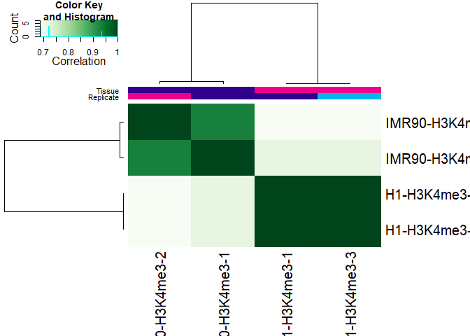


You can next go ahead and further analysis the differences in enriched regions detected for the two cell lines. Further details can be found in the [DiffBind vignette](http://bioconductor.org/packages/release/bioc/vignettes/DiffBind/inst/doc/DiffBind.pdf).     

We are not going to do this here, instead we are going to create a  *consensus peak set*, which we will use for our differential modification analysis:

```
  consensus_peaks <- dba.peakset(DBA, bRetrieve=TRUE)
  save(file='Trieste_Data/ChIP-Seq/RoI/MACS2consensus_peaks.rData',consensus_peaks)

df <- data.frame(seqnames=seqnames(consensus_peaks),
  starts=start(consensus_peaks)-1,
  ends=end(consensus_peaks),
  names=paste('MACS2consensus-',seq(1,length(consensus_peaks)),sep=''),
  scores=c(rep(1, length(consensus_peaks))),
  strands=strand(consensus_peaks))

write.table(df, file="Trieste_Data/ChIP-Seq/RoI/MACS2consensus_peaks.bed", quote=F, sep="\t", row.names=F, col.names=F)
```


## Differential Modification (Affinity) Analysis (DiffBind)

We are not only interested in where we find the modification on the genome, but also how much we find there. We therefore continue with a Differential Modification Analysis on the consensus peak set. To do that we need to count how many reads overlap with each peak in each of the samples:


```
  DBA <- dba.count(DBA)
```

```
## Warning in dba.multicore.init(DBA$config): Parallel execution unavailable:
## executing serially.

## Sample: Trieste_Data/ChIP-Seq/bowtie2/chr19-IMR90-H3K4me3-1.bam125

## Sample: Trieste_Data/ChIP-Seq/bowtie2/chr19-IMR90-H3K4me3-2.bam125

## Sample: Trieste_Data/ChIP-Seq/bowtie2/chr19-H1-H3K4me3-1.bam125

## Sample: Trieste_Data/ChIP-Seq/bowtie2/chr19-H1-H3K4me3-3.bam125

## Sample: Trieste_Data/ChIP-Seq/bowtie2/chr19-IMR90-Input.bam125

## Sample: Trieste_Data/ChIP-Seq/bowtie2/chr19-H1-Input-2.bam125
```

Once we have counted the reads, we can again observe how well samples correlate, or alternatively perform principal component analysis.


```
  plot(DBA)
```

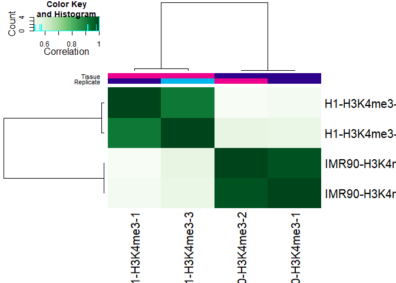

```
  dba.plotPCA(DBA,DBA_TISSUE,label=DBA_CONDITION)
```
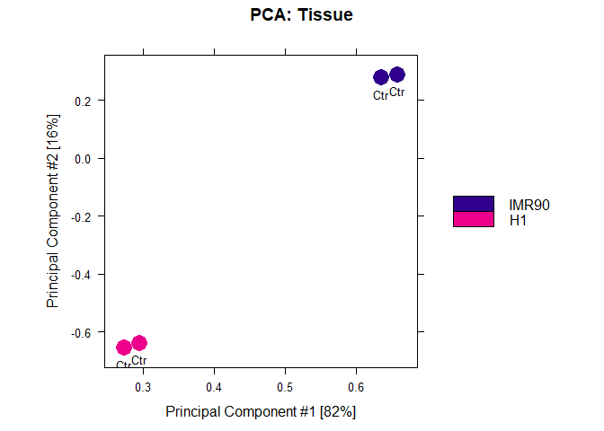

The next step, will be a statistical test to determine regions which are significantly different between H1 and IMR90 cells. In this case, we have to set a contrast between the different tissues.
(In other cases, we might want to find differences between conditions, e.g. control vs treatment, we would then set categories=DBA_CONDITION)

```
  DBA <- dba.contrast(DBA,categories=DBA_TISSUE,minMembers=2)
```

DiffBind allows access to several methods for statistical testing of count data, most notable EdgeR and DESeq2. The Default method is (DESeq2)[https://genomebiology.biomedcentral.com/articles/10.1186/s13059-014-0550-8], which was initially developed for RNA-Seq data sets. Note, that there are also a number of normalization options. Here we will use the default normalization. It is important to think about this and to explore the DiffBind vignette further. **The results can change massively when using a different normalization method.**

```
  DBA <- dba.analyze(DBA)
```

```
## converting counts to integer mode

## gene-wise dispersion estimates


## mean-dispersion relationship


## final dispersion estimates
```


The new DBA object has a contrast field added. It shows that you are comparing a group **IMR90** with 2 members to a group **H1** with also two members. Using DESeq it has found 727 peaks to be differentially modified between the two groups.


```
  DBA
```

```
## 4 Samples, 1509 sites in matrix:
##                ID Tissue  Factor Condition Replicate Caller Intervals FRiP
## 1 IMR90-H3K4me3-1  IMR90 H3K4me3       Ctr         1 counts      1509 0.92
## 2 IMR90-H3K4me3-2  IMR90 H3K4me3       Ctr         2 counts      1509 0.89
## 3    H1-H3K4me3-1     H1 H3K4me3       Ctr         1 counts      1509 0.79
## 4    H1-H3K4me3-3     H1 H3K4me3       Ctr         3 counts      1509 0.77
##
## 1 Contrast:
##   Group1 Members1 Group2 Members2 DB.DESeq2
## 1  IMR90        2     H1        2       727
```

We next examine the results:

```
  dba.plotMA(DBA)
```

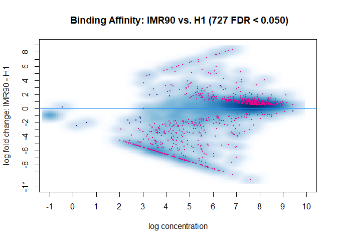


```
  dba.plotVolcano(DBA)
```

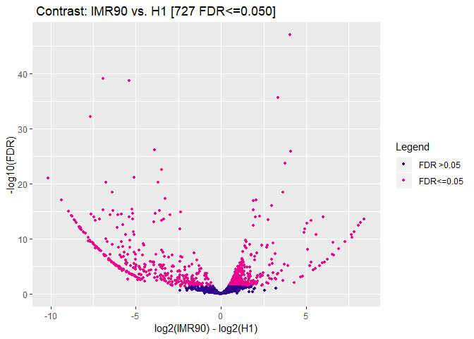


```
  DBA.DB <- dba.report(DBA)
  DBA.DB
```

```
## GRanges object with 727 ranges and 6 metadata columns:
##        seqnames            ranges strand |      Conc Conc_IMR90   Conc_H1
##           <Rle>         <IRanges>  <Rle> | <numeric>  <numeric> <numeric>
##    447       19 13838771-13843376      * |      8.21       9.13      5.08
##    886       19 39514797-39516610      * |      6.99       1.05      7.98
##    833       19 38264388-38265875      * |      7.01       2.57      7.98
##   1147       19 47713298-47714904      * |      7.88       8.74      5.41
##    630       19 19860238-19861389      * |      6.81       0.16      7.81
##    ...      ...               ...    ... .       ...        ...       ...
##   1442       19 57239914-57241846      * |      8.44       8.67      8.17
##    101       19   2598914-2599608      * |      5.02       5.61      4.02
##   1394       19 55115999-55117640      * |      7.62       7.91      7.27
##   1003       19 43934252-43935818      * |      7.98       8.24      7.66
##    920       19 40714576-40719638      * |      8.95       9.16      8.71
##             Fold   p-value       FDR
##        <numeric> <numeric> <numeric>
##    447      4.05  6.14e-51  9.27e-48
##    886     -6.93  9.76e-43  7.36e-40
##    833      -5.4  3.13e-42  1.57e-39
##   1147      3.34  6.63e-39   2.5e-36
##    630     -7.65  2.47e-35  7.46e-33
##    ...       ...       ...       ...
##   1442       0.5    0.0226    0.0472
##    101      1.58    0.0229    0.0477
##   1394      0.64    0.0229    0.0477
##   1003      0.58    0.0231     0.048
##    920      0.45     0.024    0.0499
##   -------
##   seqinfo: 1 sequence from an unspecified genome; no seqlengths
```


### RRBS Data Analysis using methylKit

We will use the following libraries:


```
source("https://bioconductor.org/biocLite.R")
biocLite("methylKit")
```

```
library(methylKit)
library(genomation)
library(ggplot2)
library(TxDb.Mmusculus.UCSC.mm10.knownGene)
# library(bsseqData)names(knitr::knit_engines$get())
```


### Loading the data into R

We will start with an analysis of a small data set comprising 4 samples, two control samples and two tumor samples. The aim is to find methylation differences. I'm providing the coverage files which are outputs from `Bismark methylation extractor tool (v0.18.1)` filtered for chromosome 11. The .cov files contain the following information:
<chromosome> <start position> <end position> <methylation percentage> <count methylated> <count unmethylated>, for example.:


```
head Trieste_Data/RRBS/chr11.RRBS_B372.cov
```

```
## chr11	3124113	3124113	0	0	6
## chr11	3124138	3124138	0	0	6
## chr11	3124161	3124161	0	0	5
## chr11	3124658	3124658	100	8	0
## chr11	3124664	3124664	0	0	8
## chr11	3126034	3126034	100	10	0
## chr11	3127214	3127214	92.511013215859	210	17
## chr11	3136007	3136007	100	10	0
## chr11	3139661	3139661	100	6	0
## chr11	3139704	3139704	100	6	0
```

To read the data into R we will first use the `MethylKit`

```
file.list <- list("Trieste_Data/RRBS/chr11.RRBS_B372.cov",
                  "Trieste_Data/RRBS/chr11.RRBS_B436.cov",
                  "Trieste_Data/RRBS/chr11.RRBS_B098.cov",
                  "Trieste_Data/RRBS/chr11.RRBS_B371.cov")

    sample.ids = list("Control.1", "Control.2","Tumor1","Tumor2")
    treatment = c(0,0,1,1)

    myobj=methRead(file.list,
        sample.id=sample.ids,
        assembly="m10",
        treatment=treatment,
        context="CpG",
        pipeline="bismarkCoverage")
```

Let's  have a first look:


```
myobj
```

```
## methylRawList object with 4 methylRaw objects
##
## methylRaw object with 60411 rows
## --------------
##     chr   start     end strand coverage numCs numTs
## 1 chr11 3126034 3126034      *       10    10     0
## 2 chr11 3127214 3127214      *      227   210    17
## 3 chr11 3136007 3136007      *       10    10     0
## 4 chr11 3148861 3148861      *       36    35     1
## 5 chr11 3149957 3149957      *       11    11     0
## 6 chr11 3149968 3149968      *       11    11     0
## --------------
## sample.id: Control.1
## assembly: m10
## context: CpG
## resolution: base
##
## methylRaw object with 44928 rows
## --------------
##     chr   start     end strand coverage numCs numTs
## 1 chr11 3124113 3124113      *       11     0    11
## 2 chr11 3124138 3124138      *       11     0    11
## 3 chr11 3124161 3124161      *       11     0    11
## 4 chr11 3124435 3124435      *       14     0    14
## 5 chr11 3124460 3124460      *       14     0    14
## 6 chr11 3127214 3127214      *      288   273    15
## --------------
## sample.id: Control.2
## assembly: m10
## context: CpG
## resolution: base
##
## methylRaw object with 79809 rows
## --------------
##     chr   start     end strand coverage numCs numTs
## 1 chr11 3105932 3105932      *       13     0    13
## 2 chr11 3106055 3106055      *       10     0    10
## 3 chr11 3111546 3111546      *       14    14     0
## 4 chr11 3111583 3111583      *       14    10     4
## 5 chr11 3118934 3118934      *       11    11     0
## 6 chr11 3124113 3124113      *       16     0    16
## --------------
## sample.id: Tumor1
## assembly: m10
## context: CpG
## resolution: base
##
## methylRaw object with 77317 rows
## --------------
##     chr   start     end strand coverage numCs numTs
## 1 chr11 3124841 3124841      *       11     0    11
## 2 chr11 3124845 3124845      *       11    11     0
## 3 chr11 3124873 3124873      *       11     0    11
## 4 chr11 3125331 3125331      *       10    10     0
## 5 chr11 3125341 3125341      *       10    10     0
## 6 chr11 3125345 3125345      *       10     3     7
## --------------
## sample.id: Tumor2
## assembly: m10
## context: CpG
## resolution: base
##
## treatment: 0 0 1 1
```

Let's look at the coverage of the CpG sites on the first sample:


```
getCoverageStats(myobj[[1]],plot=TRUE,both.strands=FALSE)
```

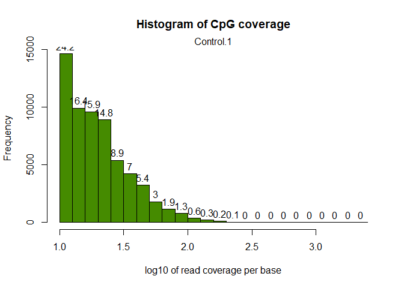


And the methylation levels:

```
getMethylationStats(myobj[[1]],plot=TRUE,both.strands=FALSE)
```

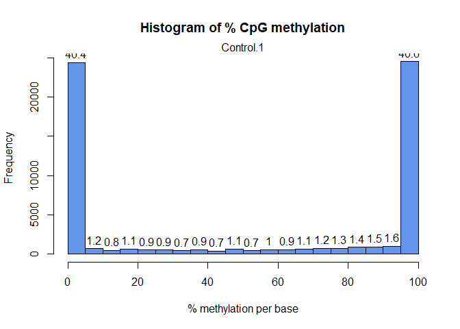


Let's filter out CpG sites with low coverage (less than 100 reads) and exceptionnaly high covered sites: How does the histogram look like now:


```
filtered.myobj = filterByCoverage(myobj,lo.count=10,lo.perc=NULL,
                                      hi.count=NULL,hi.perc=99.9)
getCoverageStats(filtered.myobj[[1]],plot=TRUE,both.strands=FALSE)
```

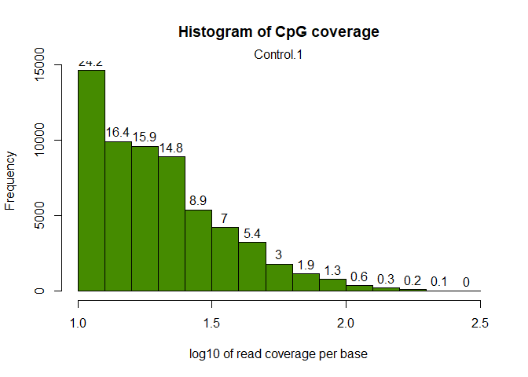

In the next step we combine the different samples into a single table:

```
meth = unite(filtered.myobj, destrand=FALSE)
nrow(meth)
```

```
## [1] 19113
```

```
head(meth)
```

<div data-pagedtable="false">
  <script data-pagedtable-source type="application/json">
{"columns":[{"label":[""],"name":["_rn_"],"type":[""],"align":["left"]},{"label":["chr"],"name":[1],"type":["chr"],"align":["left"]},{"label":["start"],"name":[2],"type":["int"],"align":["right"]},{"label":["end"],"name":[3],"type":["int"],"align":["right"]},{"label":["strand"],"name":[4],"type":["chr"],"align":["left"]},{"label":["coverage1"],"name":[5],"type":["int"],"align":["right"]},{"label":["numCs1"],"name":[6],"type":["int"],"align":["right"]},{"label":["numTs1"],"name":[7],"type":["int"],"align":["right"]},{"label":["coverage2"],"name":[8],"type":["int"],"align":["right"]},{"label":["numCs2"],"name":[9],"type":["int"],"align":["right"]},{"label":["numTs2"],"name":[10],"type":["int"],"align":["right"]},{"label":["coverage3"],"name":[11],"type":["int"],"align":["right"]},{"label":["numCs3"],"name":[12],"type":["int"],"align":["right"]},{"label":["numTs3"],"name":[13],"type":["int"],"align":["right"]},{"label":["coverage4"],"name":[14],"type":["int"],"align":["right"]},{"label":["numCs4"],"name":[15],"type":["int"],"align":["right"]},{"label":["numTs4"],"name":[16],"type":["int"],"align":["right"]}],"data":[{"1":"chr11","2":"3148861","3":"3148861","4":"*","5":"36","6":"35","7":"1","8":"25","9":"25","10":"0","11":"17","12":"17","13":"0","14":"23","15":"23","16":"0","_rn_":"1"},{"1":"chr11","2":"3149957","3":"3149957","4":"*","5":"11","6":"11","7":"0","8":"16","9":"16","10":"0","11":"16","12":"16","13":"0","14":"18","15":"18","16":"0","_rn_":"2"},{"1":"chr11","2":"3149968","3":"3149968","4":"*","5":"11","6":"11","7":"0","8":"16","9":"16","10":"0","11":"16","12":"16","13":"0","14":"18","15":"15","16":"3","_rn_":"3"},{"1":"chr11","2":"3150593","3":"3150593","4":"*","5":"75","6":"75","7":"0","8":"35","9":"35","10":"0","11":"117","12":"117","13":"0","14":"90","15":"90","16":"0","_rn_":"4"},{"1":"chr11","2":"3150601","3":"3150601","4":"*","5":"75","6":"64","7":"11","8":"35","9":"35","10":"0","11":"118","12":"109","13":"9","14":"91","15":"88","16":"3","_rn_":"5"},{"1":"chr11","2":"3150641","3":"3150641","4":"*","5":"75","6":"75","7":"0","8":"35","9":"35","10":"0","11":"118","12":"118","13":"0","14":"91","15":"81","16":"10","_rn_":"6"}],"options":{"columns":{"min":{},"max":[10]},"rows":{"min":[10],"max":[10]},"pages":{}}}
  </script>
</div>

We are left with 19113 CpG sites.
For these we are now interested in the correlation of their methylation levels between samples.


```
getCorrelation(meth,plot=TRUE)
```

```
##           Control.1 Control.2    Tumor1    Tumor2
## Control.1 1.0000000 0.9131654 0.8371150 0.8385037
## Control.2 0.9131654 1.0000000 0.8312758 0.8332286
## Tumor1    0.8371150 0.8312758 1.0000000 0.8505829
## Tumor2    0.8385037 0.8332286 0.8505829 1.0000000
```

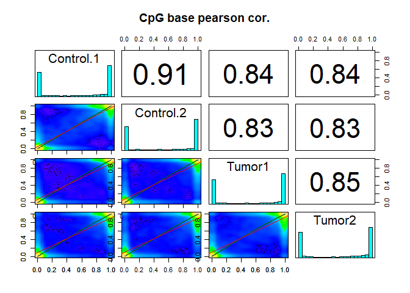

We can also cluster the samples as a first sanity check:

```
clusterSamples(meth, dist="correlation", method="ward", plot=TRUE)
```

```
## The "ward" method has been renamed to "ward.D"; note new "ward.D2"
```

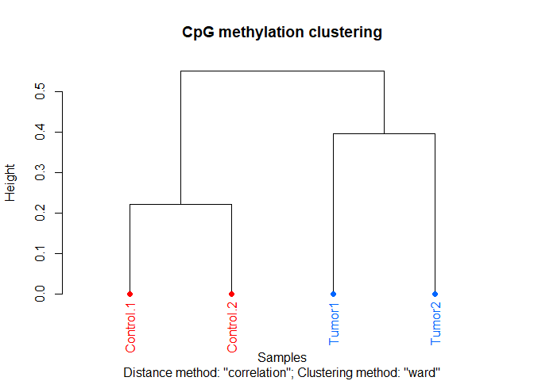

```
##
## Call:
## hclust(d = d, method = HCLUST.METHODS[hclust.method])
##
## Cluster method   : ward.D
## Distance         : pearson
## Number of objects: 4
```

Or we use Principal Component Analysis

```
PCASamples(meth,adj.lim=c(1,0.4))
```

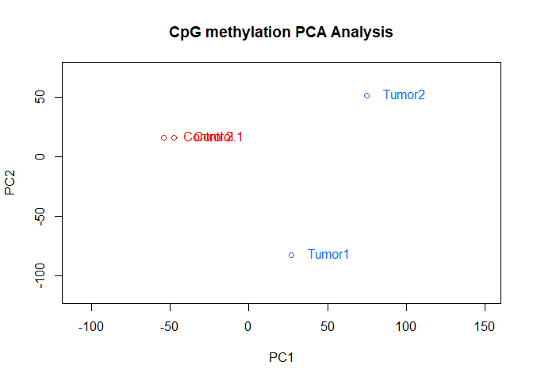

As you can see, the Control samples cluster together nicely. However, not surprisingly, there is quite some difference between the tumor samples.

The next thing you might want to do is examine and remove batch effects. Have a look at the `methylKit` documentation for more details.

Here we will continue to examine the methylation levels across the different samples:


```
mat=percMethylation(meth)
head(mat)
```

```
##   Control.1 Control.2    Tumor1    Tumor2
## 1  97.22222       100 100.00000 100.00000
## 2 100.00000       100 100.00000 100.00000
## 3 100.00000       100 100.00000  83.33333
## 4 100.00000       100 100.00000 100.00000
## 5  85.33333       100  92.37288  96.70330
## 6 100.00000       100 100.00000  89.01099
```

In order to look at violin plots of the methylation levels for the different samples we will create a new data frame:


```
m = as.vector(mat)
s =  c(rep(sample.ids[[1]],nrow(meth)),rep(sample.ids[[2]],nrow(meth)),
    rep(sample.ids[[3]],nrow(meth)),rep(sample.ids[[4]],nrow(meth)))

c = c(rep('Ctr',2*nrow(meth)),
    rep('Tu',2*nrow(meth)  ))
DD = data.frame(mCpG=m,sample=as.factor(s),condition=as.factor(c))
```


```
data_summary <- function(x) {
   m <- mean(x)
   ymin <- m-sd(x)
   ymax <- m+sd(x)
   return(c(y=m,ymin=ymin,ymax=ymax))
}

p <- ggplot(DD, aes(x=sample, y=mCpG,fill = condition)) +
    geom_violin(trim=FALSE) +
    scale_fill_manual(values=c( "#a6cee3","#1f78b4","#b2df8a","#33a02c"))+
    coord_flip()+
    labs(x="sample", y = "% mCpG")+
    stat_summary(fun.data=data_summary)
    geom_boxplot(width=0.1)

    plot(p)
```


### Differential Analysis of methylated CpGs

We next try to find CpGs which are significantly different between conditions:


```
myDiff=calculateDiffMeth(meth)
```

```
## two groups detected:
##  will calculate methylation difference as the difference of
## treatment (group: 1) - control (group: 0)
```

Let's have a look at the results:


```
head(myDiff)
```

<div data-pagedtable="false">
  <script data-pagedtable-source type="application/json">
{"columns":[{"label":[""],"name":["_rn_"],"type":[""],"align":["left"]},{"label":["chr"],"name":[1],"type":["chr"],"align":["left"]},{"label":["start"],"name":[2],"type":["int"],"align":["right"]},{"label":["end"],"name":[3],"type":["int"],"align":["right"]},{"label":["strand"],"name":[4],"type":["chr"],"align":["left"]},{"label":["pvalue"],"name":[5],"type":["dbl"],"align":["right"]},{"label":["qvalue"],"name":[6],"type":["dbl"],"align":["right"]},{"label":["meth.diff"],"name":[7],"type":["dbl"],"align":["right"]}],"data":[{"1":"chr11","2":"3148861","3":"3148861","4":"*","5":"0.313697659","6":"0.284625447","7":"1.639344","_rn_":"1"},{"1":"chr11","2":"3149957","3":"3149957","4":"*","5":"1.000000000","6":"0.498831247","7":"0.000000","_rn_":"2"},{"1":"chr11","2":"3149968","3":"3149968","4":"*","5":"0.056749776","6":"0.066698908","7":"-8.823529","_rn_":"3"},{"1":"chr11","2":"3150593","3":"3150593","4":"*","5":"1.000000000","6":"0.498831247","7":"0.000000","_rn_":"4"},{"1":"chr11","2":"3150601","3":"3150601","4":"*","5":"0.171194749","6":"0.172300053","7":"4.258373","_rn_":"5"},{"1":"chr11","2":"3150641","3":"3150641","4":"*","5":"0.003312862","6":"0.005850224","7":"-4.784689","_rn_":"6"}],"options":{"columns":{"min":{},"max":[10]},"rows":{"min":[10],"max":[10]},"pages":{}}}
  </script>
</div>

```
# get hyper methylated bases
myDiff25p.hyper=getMethylDiff(myDiff,difference=25,qvalue=0.01,type="hyper")
#
# get hypo methylated bases
myDiff25p.hypo=getMethylDiff(myDiff,difference=25,qvalue=0.01,type="hypo")
#
#
# get all differentially methylated bases
myDiff25p=getMethylDiff(myDiff,difference=25,qvalue=0.01)
diffMethPerChr(myDiff,plot=TRUE,qvalue.cutoff=0.01, meth.cutoff=25)
```

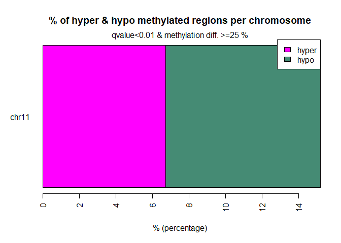


### Annotating Differentially methylated bases

First we need to get the genomic annotation and turn it into a GRangesList object

```
txdb = TxDb.Mmusculus.UCSC.mm10.knownGene
seqlevels(txdb) <- "chr11"


exons <- unlist(exonsBy(txdb))
names(exons) <- NULL
type='exons'
mcols(exons) = type

introns <- unlist(intronsByTranscript(txdb))
names(introns) <- NULL
type='intron'
mcols(introns) = type

promoters <- promoters(txdb)
names(promoters) <- NULL
type='promoters'
mcols(promoters) = type

TSSes <- promoters(txdb,upstream=1, downstream=1)
names(TSSes) <- NULL
type='TSSes'
mcols(TSSes) = type

Anno <- GRangesList()
Anno$exons <- exons
Anno$introns <- introns
Anno$promoters <- promoters
Anno$TSSes <- TSSes
```


```
diffAnnhyper=annotateWithGeneParts(as(myDiff25p.hyper,"GRanges"),Anno)
getTargetAnnotationStats(diffAnnhyper,percentage=TRUE,precedence=TRUE)
```

```
##   promoter       exon     intron intergenic
##      20.36      14.92      40.57      24.15
```

```
plotTargetAnnotation(diffAnnhyper,precedence=TRUE,
    main="hypermethylated CpGs")
```

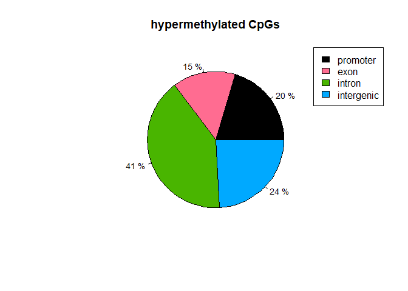

```
diffAnnhypo=annotateWithGeneParts(as(myDiff25p.hypo,"GRanges"),Anno)
getTargetAnnotationStats(diffAnnhypo,percentage=TRUE,precedence=TRUE)
```

```
##   promoter       exon     intron intergenic
##      10.22      11.54      39.25      39.00
```

```
plotTargetAnnotation(diffAnnhypo,precedence=TRUE,
    main="hypomethylated CpGs")
```

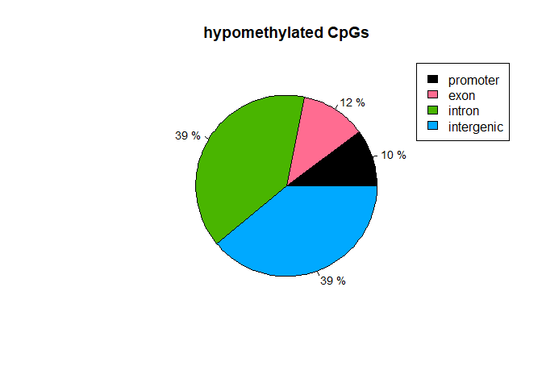

```
library("AnnotationHub")
library("annotatr")
annots = c('mm10_cpgs')
annotations = build_annotations(genome = 'mm10', annotations = annots)
diffCpGann=annotateWithFeatureFlank(as(myDiff25p,"GRanges"),
                                    cpg.obj$CpGi,cpg.obj$shores,
                         feature.name="CpGi",flank.name="shores")
plotTargetAnnotation(diffCpGann,col=c("green","gray","white"),
       main="differential methylation annotation")
```

Interesstingly, we find that CpGs in Promoter Regions are more likely to gain methylation in the tumor samples, and that CpGs in intergenic regions are more likely to loose methylation.

In addition to an analysis of individual CpGs, methylKit also allows to follow a tiling window approach. See the Vignette for more details.

## RRBS Data Analysis using BSSeq

We will use the following libraries:


```
#source("https://bioconductor.org/biocLite.R")
#biocLite("genomation")

library(bsseq)
library(DSS)
```


### Loading Reads into R

In this tutorial we will use a data set which is provided with the package `bsseqData`. However, if you wanted to anaylse your own data sets which you have aligned for example with `Bismark` the package provides several functions to parse outputs from  these aligners e.g. `read.bismark`.


```
path = 'Trieste_Data/RRBS/'

dat1.1 <- read.table(file.path(path, "chr11.RRBS_B372.cov.mod2"), header=TRUE, col.names=c("chr","pos", "N", "X"))
dat1.2 <- read.table(file.path(path, "chr11.RRBS_B436.cov.mod2"), header=TRUE, col.names=c("chr","pos", "N", "X"))
dat2.1 <- read.table(file.path(path, "chr11.RRBS_B098.cov.mod2"), header=TRUE, col.names=c("chr","pos", "N", "X"))
dat2.2 <- read.table(file.path(path, "chr11.RRBS_B371.cov.mod2"), header=TRUE, col.names=c("chr","pos", "N", "X"))

sample.ids = list("Control.1", "Control.2","Tumor1","Tumor2")
treatment = c(0,0,1,1)

Type <- c("control", "control","tumor","tumor")
names(Type) <- sample.ids

BS.cancer.ex <- makeBSseqData( list(dat1.1, dat1.2,
                            dat2.1, dat2.2),
                       sampleNames =  sample.ids)

pData(BS.cancer.ex) <- data.frame(Type= Type)
```

### The Example Data Set

We will use a data set provided with the `BS.cancer.ex` data package.
It already contains a `BSseq` object storing data on chromosome 21 and 22 from a whole-genome bisulfite sequencing (WGBS) experiment for colon cancer. For this experiment, 3 patients were sequenced and the data contains matched colon cancer and normal colon. For more details see `?BS.cancer.ex`.

We load the data and update the `BSseq` object in order to use it with the current class definitoin:


```
# data(BS.cancer.ex)
# BS.cancer.ex <- updateObject(BS.cancer.ex)
```

Let's have a quick look at the data:


```
BS.cancer.ex
```

```
## An object of type 'BSseq' with
##   210936 methylation loci
##   4 samples
## has not been smoothed
## All assays are in-memory
```

And to retrieve some more information about the experimental phenotypes:

```
pData(BS.cancer.ex)
```

```
## DataFrame with 4 rows and 1 column
##               Type
##           <factor>
## Control.1  control
## Control.2  control
## Tumor1       tumor
## Tumor2       tumor
```


```
cols <- c('#fc8d59','#91cf60')
names(cols) <- c("tumor","control")
```

### Initial Analysis  

Let's subset the data even further to only look at chromsome 11:

```
BS.cancer.ex <- chrSelectBSseq(BS.cancer.ex, seqnames = "chr11", order = TRUE)
```

How many sites are we looking at now?

```
length(BS.cancer.ex)
```

```
## [1] 210936
```

Let's have a look at the first 10 genomic positions:

```
head(granges(BS.cancer.ex), n = 10)
```

```
## GRanges object with 10 ranges and 0 metadata columns:
##        seqnames    ranges strand
##           <Rle> <IRanges>  <Rle>
##    [1]    chr11   3101784      *
##    [2]    chr11   3101793      *
##    [3]    chr11   3101800      *
##    [4]    chr11   3101810      *
##    [5]    chr11   3102205      *
##    [6]    chr11   3102221      *
##    [7]    chr11   3104155      *
##    [8]    chr11   3104662      *
##    [9]    chr11   3104734      *
##   [10]    chr11   3105932      *
##   -------
##   seqinfo: 1 sequence from an unspecified genome; no seqlengths
```

What is the read coverage at these positions ?

```
BS.cov <- getCoverage(BS.cancer.ex)
head(BS.cov, n = 10)
```

```
## <10 x 4> DelayedMatrix object of type "double":
##       Control.1 Control.2 Tumor1 Tumor2
##  [1,]         0         0      8      0
##  [2,]         0         0      8      0
##  [3,]         0         0      8      0
##  [4,]         0         0      8      0
##  [5,]         0         0      0      4
##  [6,]         0         0      0      4
##  [7,]         0         0      1      0
##  [8,]         0         0      0      1
##  [9,]         0         0      0      5
## [10,]         0         0     13      0
```

And the methylation level ?

```
BS.met <- getMeth(BS.cancer.ex,  type = "raw")
head(BS.met, n = 10)
```

```
## <10 x 4> DelayedMatrix object of type "double":
##       Control.1 Control.2 Tumor1 Tumor2
##  [1,]       NaN       NaN  0.000    NaN
##  [2,]       NaN       NaN  0.000    NaN
##  [3,]       NaN       NaN  0.125    NaN
##  [4,]       NaN       NaN  0.000    NaN
##  [5,]       NaN       NaN    NaN  0.000
##  [6,]       NaN       NaN    NaN  0.000
##  [7,]       NaN       NaN  0.000    NaN
##  [8,]       NaN       NaN    NaN  1.000
##  [9,]       NaN       NaN    NaN  0.000
## [10,]       NaN       NaN  1.000    NaN
```

We could also be interessted in the coverage / methylation level of all CpGs within a certain region, say for a 2800bp region on Chromosome 11 from 3191001 to 3193800:    

```
Reg <- GRanges(seqname='chr11',IRanges( 3191001,3193800))
getCoverage(BS.cancer.ex,regions=Reg)
```

```
## [[1]]
##       [,1] [,2] [,3] [,4]
##  [1,]    5    0    0    0
##  [2,]    0    9    0    0
##  [3,]    0    9    0    0
##  [4,]    9    0   11    0
##  [5,]    9    0   11    0
##  [6,]    9    0   11    0
##  [7,]    9    0   11    0
##  [8,]    9    0   11    0
##  [9,]    8    0    0    0
## [10,]    3    9   18   25
## [11,]    3    9   18   25
## [12,]    3    9   18   25
## [13,]  576  389  732 1049
## [14,]    3    9   18   25
## [15,]  578  389  734 1050
## [16,]    0    0    0    2
## [17,]  578  389  732 1049
## [18,]  403  284  412  814
## [19,]   91   68  198  334
## [20,]  404  284  413  816
## [21,]   92   68  198  334
## [22,]  350  247  761 1260
## [23,]   92   68  198  334
## [24,]  352  247  763 1262
## [25,]   92   68  198  334
## [26,]  352  248  764 1263
## [27,]   92   68  198  334
## [28,]  352  249  764 1263
## [29,]   92   66  198  335
## [30,]  354  249  765 1268
## [31,]   90   64  181  321
## [32,]  354  249  764 1270
## [33,]   89   63  178  317
## [34,]  354  249  764 1270
## [35,]   89   62  175  315
## [36,]  354  249  764 1270
## [37,]    0    0    0    1
## [38,]  354  249  764 1261
## [39,]    0    0    0    1
## [40,]  351  245  737 1236
## [41,]  301  183  348  489
## [42,]  354  248  763 1260
## [43,]  302  183  349  491
## [44,]    0    0    0    3
## [45,]    0    0    0    4
## [46,]    0    0    0    3
## [47,]    0    0    0    4
## [48,]    0    0    0    3
## [49,] 1056  583 1307 1347
## [50,]    0    0    0    3
## [51,] 1063  583 1315 1351
## [52,]    0   12    7   22
## [53,] 1062  580 1304 1347
## [54,]    0   12    7   28
## [55,]    0   12    7   27
## [56,]    0   12    7   27
## [57,]    0   12    7   27
```

```
getMeth(BS.cancer.ex,  type = "raw",regions=Reg)
```

```
## [[1]]
##             [,1]        [,2]       [,3]       [,4]
##  [1,] 0.00000000         NaN        NaN        NaN
##  [2,]        NaN 0.000000000        NaN        NaN
##  [3,]        NaN 0.000000000        NaN        NaN
##  [4,] 1.00000000         NaN 0.00000000        NaN
##  [5,] 1.00000000         NaN 0.09090909        NaN
##  [6,] 0.00000000         NaN 0.00000000        NaN
##  [7,] 0.00000000         NaN 0.00000000        NaN
##  [8,] 0.00000000         NaN 0.00000000        NaN
##  [9,] 0.00000000         NaN        NaN        NaN
## [10,] 1.00000000 1.000000000 1.00000000 1.00000000
## [11,] 0.00000000 1.000000000 0.77777778 0.32000000
## [12,] 0.00000000 1.000000000 0.77777778 0.32000000
## [13,] 0.15277778 0.028277635 0.03551913 0.04385129
## [14,] 0.00000000 1.000000000 0.77777778 0.32000000
## [15,] 0.08996540 0.077120823 0.08038147 0.04952381
## [16,]        NaN         NaN        NaN 0.00000000
## [17,] 0.32179931 0.208226221 0.15300546 0.17159199
## [18,] 0.38461538 0.450704225 0.19660194 0.14250614
## [19,] 0.12087912 0.147058824 0.02525253 0.05988024
## [20,] 0.12128713 0.123239437 0.04842615 0.07720588
## [21,] 0.23913043 0.176470588 0.03030303 0.08682635
## [22,] 0.17142857 0.085020243 0.02759527 0.06031746
## [23,] 0.09782609 0.176470588 0.03535354 0.05988024
## [24,] 0.05965909 0.056680162 0.03538663 0.03486529
## [25,] 0.11956522 0.117647059 0.03535354 0.06586826
## [26,] 0.07670455 0.024193548 0.03926702 0.03562945
## [27,] 0.15217391 0.044117647 0.08080808 0.11976048
## [28,] 0.05681818 0.020080321 0.09031414 0.03562945
## [29,] 0.07608696 0.030303030 0.09595960 0.08955224
## [30,] 0.06497175 0.004016064 0.02091503 0.02917981
## [31,] 0.04444444 0.000000000 0.03867403 0.08099688
## [32,] 0.05932203 0.068273092 0.02486911 0.02283465
## [33,] 0.15730337 0.079365079 0.08426966 0.05993691
## [34,] 0.09039548 0.048192771 0.02094241 0.05826772
## [35,] 0.05617978 0.000000000 0.05714286 0.06984127
## [36,] 0.02542373 0.044176707 0.03272251 0.02913386
## [37,]        NaN         NaN        NaN 0.00000000
## [38,] 0.07627119 0.128514056 0.02748691 0.04678826
## [39,]        NaN         NaN        NaN 0.00000000
## [40,] 0.10826211 0.187755102 0.04070556 0.03883495
## [41,] 0.03986711 0.071038251 0.04885057 0.00204499
## [42,] 0.02259887 0.032258065 0.01179554 0.01904762
## [43,] 0.07284768 0.005464481 0.04871060 0.00203666
## [44,]        NaN         NaN        NaN 0.00000000
## [45,]        NaN         NaN        NaN 0.00000000
## [46,]        NaN         NaN        NaN 1.00000000
## [47,]        NaN         NaN        NaN 1.00000000
## [48,]        NaN         NaN        NaN 0.00000000
## [49,] 0.13257576 0.051457976 0.07727621 0.05048255
## [50,]        NaN         NaN        NaN 0.00000000
## [51,] 0.09125118 0.137221269 0.16501901 0.11102887
## [52,]        NaN 0.000000000 0.00000000 0.00000000
## [53,] 0.04613936 0.037931034 0.06058282 0.01262064
## [54,]        NaN 0.000000000 0.00000000 0.00000000
## [55,]        NaN 0.000000000 0.00000000 0.00000000
## [56,]        NaN 0.000000000 0.00000000 0.00000000
## [57,]        NaN 0.000000000 0.00000000 0.00000000
```

Why are there so many NANs in the methylation calls?

Let's have a look at the coverage:
Globally, how many methylation calls do we have ?

```
coverage.per.sample <- colSums(BS.cov)
barplot( coverage.per.sample, ylab="Number of observations per sample", names= rownames(attr( BS.cancer.ex ,"colData")),col=cols[match(BS.cancer.ex$Type,names(cols))])
```

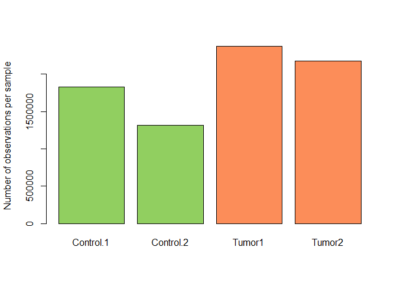

What is the `numbegetCorrelation(meth,plot=TRUE)r` / percentage of CpGs with 0 coverage in all samples ?

```
sum(rowSums(BS.cov) == 0)
```

```
## [1] 0
```

Coverage per CpG

```
hist( rowSums(BS.cov), breaks=1000, xlab="Coverage per CpG sites", main= "Coverage per CpG sites")
```

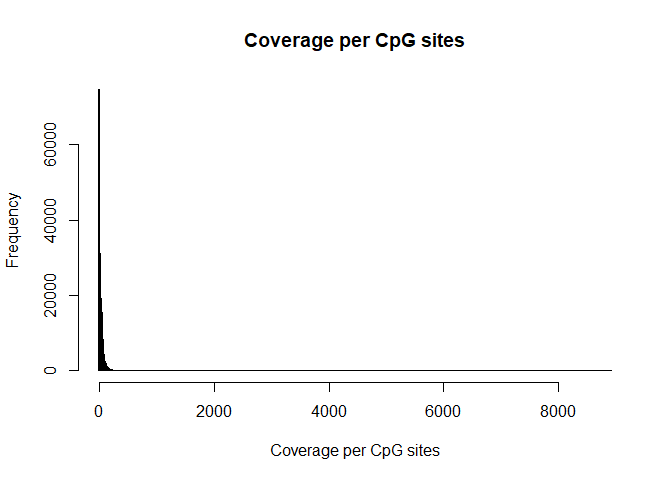

```
hist( rowSums(BS.cov), breaks=1000, xlab="Coverage per CpG sites", main= "Coverage per CpG sites", xlim=c(0,200))
```

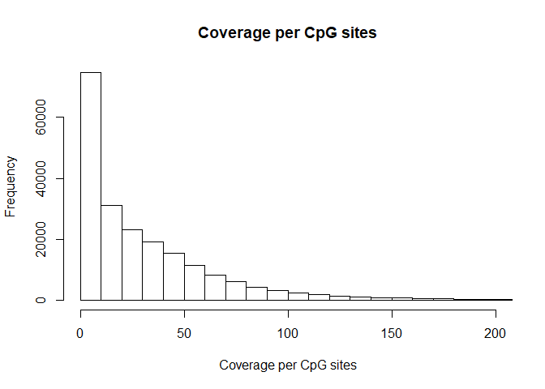

Number / percentage of CpGs which are covered by at least 1 read in all 6 samples

```
sum(rowSums( BS.cov >= 10) == 4)
```

```
## [1] 19209
```

```
round(sum(rowSums( BS.cov >= 1) == 4) / length(BS.cancer.ex)*100,2)
```

```
## [1] 36.43
```

## BSsmooth: Fitting over region

applies local averaging to improve precision of regional methylation measurements / minimize coverage issues
It can take a some minutes


```
BS.cancer.ex.fit <- BSmooth(BS.cancer.ex, verbose = TRUE)
```

```
## [BSmooth] preprocessing ... done in 0.2 sec
## [BSmooth] smoothing by 'sample' (mc.cores = 1, mc.preschedule = FALSE)
## [BSmooth] sample Tumor1 (out of 4), done in 8.5 sec
## [BSmooth] sample Tumor2 (out of 4), done in 8.8 sec
## [BSmooth] smoothing done in 33.5 sec
```

### Filtering loci per coverate          

```
keepLoci.ex <- which(rowSums(BS.cov[, BS.cancer.ex$Type == "tumor"] >= 2) >= 2 &
                       rowSums(BS.cov[, BS.cancer.ex$Type == "control"] >= 2) >= 2)

length(keepLoci.ex)
```

```
## [1] 66383
```

```
BS.cancer.ex.fit <- BS.cancer.ex.fit[keepLoci.ex,]

#####
BS.cancer.ex.tstat <- BSmooth.tstat(BS.cancer.ex.fit,
                                    group1 = c("Tumor1","Tumor2"),
                                    group2 = c("Control.1", "Control.2"),
                                    estimate.var = "group2",
                                    local.correct = TRUE,
                                    verbose = TRUE)
```

```
## [BSmooth.tstat] preprocessing ... done in 0.1 sec
## [BSmooth.tstat] computing stats within groups ... done in 0.1 sec
## [BSmooth.tstat] computing stats across groups ... done in 0.8 sec
```

## Finding DMRs

```
dmrs0 <- dmrFinder(BS.cancer.ex.tstat, cutoff = c(-4.6, 4.6))
```

```
## [dmrFinder] creating dmr data.frame
```

```
dmrs <- subset(dmrs0, n >= 3 & abs(meanDiff) >= 0.1)
head(dmrs)
```

<div data-pagedtable="false">
  <script data-pagedtable-source type="application/json">
{"columns":[{"label":[""],"name":["_rn_"],"type":[""],"align":["left"]},{"label":["chr"],"name":[1],"type":["chr"],"align":["left"]},{"label":["start"],"name":[2],"type":["int"],"align":["right"]},{"label":["end"],"name":[3],"type":["int"],"align":["right"]},{"label":["idxStart"],"name":[4],"type":["int"],"align":["right"]},{"label":["idxEnd"],"name":[5],"type":["int"],"align":["right"]},{"label":["cluster"],"name":[6],"type":["dbl"],"align":["right"]},{"label":["n"],"name":[7],"type":["int"],"align":["right"]},{"label":["width"],"name":[8],"type":["dbl"],"align":["right"]},{"label":["invdensity"],"name":[9],"type":["dbl"],"align":["right"]},{"label":["areaStat"],"name":[10],"type":["dbl"],"align":["right"]},{"label":["maxStat"],"name":[11],"type":["dbl"],"align":["right"]},{"label":["meanDiff"],"name":[12],"type":["dbl"],"align":["right"]},{"label":["group1.mean"],"name":[13],"type":["dbl"],"align":["right"]},{"label":["group2.mean"],"name":[14],"type":["dbl"],"align":["right"]},{"label":["tstat.sd"],"name":[15],"type":["dbl"],"align":["right"]},{"label":["direction"],"name":[16],"type":["chr"],"align":["left"]}],"data":[{"1":"chr11","2":"82930464","3":"82932037","4":"33615","5":"33764","6":"6196","7":"150","8":"1574","9":"10.493333","10":"-1305.4457","11":"-4.827954","12":"-0.6736451","13":"0.1737162","14":"0.8473614","15":"0.07284007","16":"hypo","_rn_":"114"},{"1":"chr11","2":"82932521","3":"82933357","4":"33765","5":"33821","6":"6197","7":"57","8":"837","9":"14.684211","10":"-588.8385","11":"-9.606609","12":"-0.7753301","13":"0.2032949","14":"0.9786251","15":"0.07008583","16":"hypo","_rn_":"115"},{"1":"chr11","2":"66525886","3":"66526886","4":"21394","5":"21460","6":"4172","7":"67","8":"1001","9":"14.940299","10":"-535.3952","11":"-4.777467","12":"-0.5656166","13":"0.3704854","14":"0.9361020","15":"0.07066659","16":"hypo","_rn_":"98"},{"1":"chr11","2":"67455427","3":"67455736","4":"21703","5":"21751","6":"4240","7":"49","8":"310","9":"6.326531","10":"-281.3411","11":"-4.600059","12":"-0.4247835","13":"0.5387665","14":"0.9635500","15":"0.06201177","16":"hypo","_rn_":"99"},{"1":"chr11","2":"69559967","3":"69560379","4":"23527","5":"23563","6":"4569","7":"37","8":"413","9":"11.162162","10":"-244.2169","11":"-5.732185","12":"-0.4856206","13":"0.3732968","14":"0.8589174","15":"0.07042821","16":"hypo","_rn_":"103"},{"1":"chr11","2":"4745997","3":"4746366","4":"1230","5":"1264","6":"218","7":"35","8":"370","9":"10.571429","10":"-225.7915","11":"-5.361329","12":"-0.3474851","13":"0.5727045","14":"0.9201896","15":"0.06854483","16":"hypo","_rn_":"78"}],"options":{"columns":{"min":{},"max":[10]},"rows":{"min":[10],"max":[10]},"pages":{}}}
  </script>
</div>

### Number of DMRs

```
nrow(dmrs)    
```

```
## [1] 68
```

### Size of the DMRs

```
boxplot( dmrs$width, ylab="Size DMR (bp)")
```

")


### Number of hypomethylated and methylated DMRs

```
barplot( c(sum(dmrs$direction == "hypo"), sum(dmrs$direction == "hyper")), ylab="Number of DMRs",
         names=c("Hypo", "Hyper"))
```

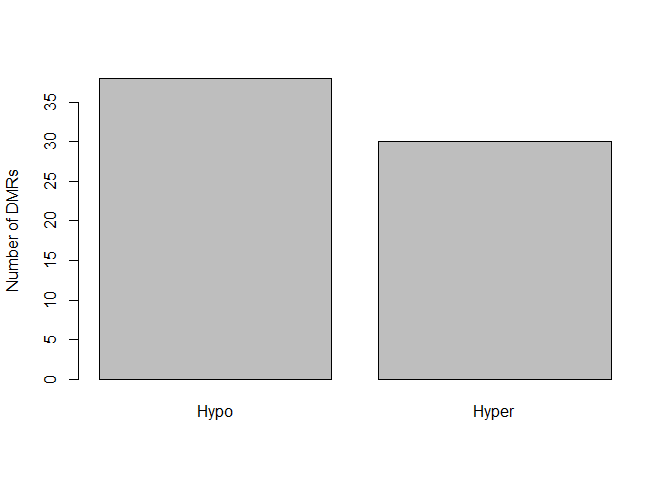


### plot example DRMs

```
plotRegion(BS.cancer.ex.fit, dmrs[2,], extend = 5000, addRegions = dmrs, col=c(rep("black",2), rep("red", 2)))
```

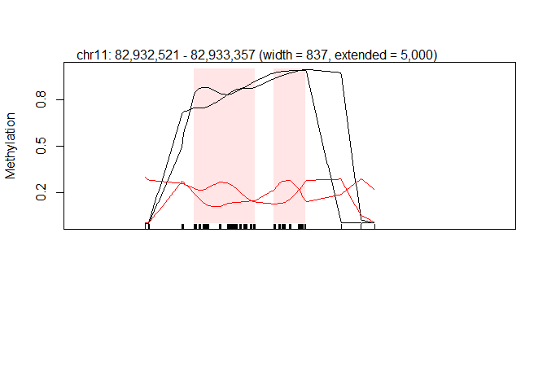

```
Reg <- GRanges(seqname=dmrs[2,1],IRanges( dmrs[2,2],dmrs[2,3]))
```

## Session Info


```
sessionInfo()
```

```
## R version 3.5.1 (2018-07-02)
## Platform: x86_64-w64-mingw32/x64 (64-bit)
## Running under: Windows 10 x64 (build 17134)
##
## Matrix products: default
##
## locale:
## [1] LC_COLLATE=English_Europe.1253  LC_CTYPE=English_Europe.1253   
## [3] LC_MONETARY=English_Europe.1253 LC_NUMERIC=C                   
## [5] LC_TIME=English_Europe.1253    
##
## attached base packages:
##  [1] splines   grid      stats4    parallel  stats     graphics  grDevices
##  [8] utils     datasets  methods   base     
##
## other attached packages:
##  [1] DSS_2.28.0                              
##  [2] bsseq_1.16.1                            
##  [3] TxDb.Mmusculus.UCSC.mm10.knownGene_3.4.0
##  [4] ggplot2_3.0.0                           
##  [5] genomation_1.12.0                       
##  [6] methylKit_1.6.1                         
##  [7] bindrcpp_0.2.2                          
##  [8] DiffBind_2.8.0                          
##  [9] SummarizedExperiment_1.10.1             
## [10] DelayedArray_0.6.5                      
## [11] BiocParallel_1.14.2                     
## [12] matrixStats_0.54.0                      
## [13] TxDb.Hsapiens.UCSC.hg38.knownGene_3.4.0
## [14] GenomicFeatures_1.32.2                  
## [15] AnnotationDbi_1.42.1                    
## [16] Biobase_2.40.0                          
## [17] GenomicRanges_1.32.6                    
## [18] GenomeInfoDb_1.16.0                     
## [19] IRanges_2.14.10                         
## [20] S4Vectors_0.18.3                        
## [21] BiocGenerics_0.26.0                     
## [22] kableExtra_0.9.0                        
## [23] knitr_1.20                              
##
## loaded via a namespace (and not attached):
##   [1] backports_1.1.2          GOstats_2.46.0          
##   [3] Hmisc_4.1-1              plyr_1.8.4              
##   [5] lazyeval_0.2.1           GSEABase_1.42.0         
##   [7] BatchJobs_1.7            gridBase_0.4-7          
##   [9] amap_0.8-16              digest_0.6.16           
##  [11] htmltools_0.3.6          GO.db_3.6.0             
##  [13] gdata_2.18.0             magrittr_1.5            
##  [15] checkmate_1.8.5          memoise_1.1.0           
##  [17] BSgenome_1.48.0          BBmisc_1.11             
##  [19] cluster_2.0.7-1          limma_3.36.2            
##  [21] Biostrings_2.48.0        readr_1.1.1             
##  [23] annotate_1.58.0          systemPipeR_1.14.0      
##  [25] R.utils_2.6.0            prettyunits_1.0.2       
##  [27] colorspace_1.4-0         blob_1.1.1              
##  [29] rvest_0.3.2              ggrepel_0.8.0           
##  [31] dplyr_0.7.6              jsonlite_1.5            
##  [33] crayon_1.3.4             RCurl_1.98-0            
##  [35] graph_1.58.0             genefilter_1.62.0       
##  [37] impute_1.54.0            bindr_0.1.1             
##  [39] brew_1.0-6               survival_2.42-6         
##  [41] sendmailR_1.2-1          glue_1.3.0              
##  [43] gtable_0.2.0             zlibbioc_1.26.0         
##  [45] XVector_0.20.0           Rhdf5lib_1.2.1          
##  [47] Rgraphviz_2.24.0         HDF5Array_1.8.1         
##  [49] scales_1.0.0             pheatmap_1.0.10         
##  [51] DBI_1.0.0                edgeR_3.22.3            
##  [53] Rcpp_0.12.18             plotrix_3.7-2           
##  [55] viridisLite_0.3.0        xtable_1.8-3            
##  [57] progress_1.2.0           emdbook_1.3.10          
##  [59] htmlTable_1.12           mclust_5.4.1            
##  [61] foreign_0.8-71           bit_1.1-14              
##  [63] Formula_1.2-3            AnnotationForge_1.22.2  
##  [65] htmlwidgets_1.2          httr_1.3.1              
##  [67] gplots_3.0.3             RColorBrewer_1.1-2      
##  [69] acepack_1.4.1            R.methodsS3_1.7.1       
##  [71] pkgconfig_2.0.2          XML_4.0-0               
##  [73] nnet_7.3-12              locfit_1.5-9.1          
##  [75] reshape2_1.4.3           tidyselect_0.2.4        
##  [77] labeling_0.3             rlang_0.2.2             
##  [79] munsell_0.5.0            tools_3.5.1             
##  [81] RSQLite_2.1.1            fastseg_1.26.0          
##  [83] evaluate_0.11            stringr_1.3.1           
##  [85] yaml_2.2.0               bit64_0.9-8             
##  [87] caTools_1.17.1.1         purrr_0.2.5             
##  [89] RBGL_1.56.0              R.oo_1.22.0             
##  [91] xml2_1.2.0               biomaRt_2.36.1          
##  [93] compiler_3.5.1           rstudioapi_0.7          
##  [95] tibble_1.4.2             geneplotter_1.58.0      
##  [97] stringi_1.2.4            highr_0.7               
##  [99] lattice_0.20-35          Matrix_1.2-15           
## [101] permute_0.9-4            pillar_1.3.0            
## [103] data.table_1.11.4        bitops_1.0-6            
## [105] rtracklayer_1.40.5       qvalue_2.12.0           
## [107] R6_2.2.2                 latticeExtra_0.6-28     
## [109] hwriter_1.3.2            ShortRead_1.38.0        
## [111] KernSmooth_2.23-15       gridExtra_2.3           
## [113] MASS_7.3-50              gtools_3.8.1            
## [115] assertthat_0.2.0         rhdf5_2.24.0            
## [117] DESeq2_1.20.0            Category_2.46.0         
## [119] rprojroot_1.3-2          rjson_0.2.20            
## [121] withr_2.1.2              GenomicAlignments_1.16.0
## [123] Rsamtools_1.32.2         GenomeInfoDbData_1.1.0  
## [125] hms_0.4.2                rpart_4.1-13            
## [127] coda_0.19-1              DelayedMatrixStats_1.2.0
## [129] rmarkdown_1.10           seqPattern_1.12.0       
## [131] bbmle_1.0.20             numDeriv_2016.8-1       
## [133] base64enc_0.1-4
```
